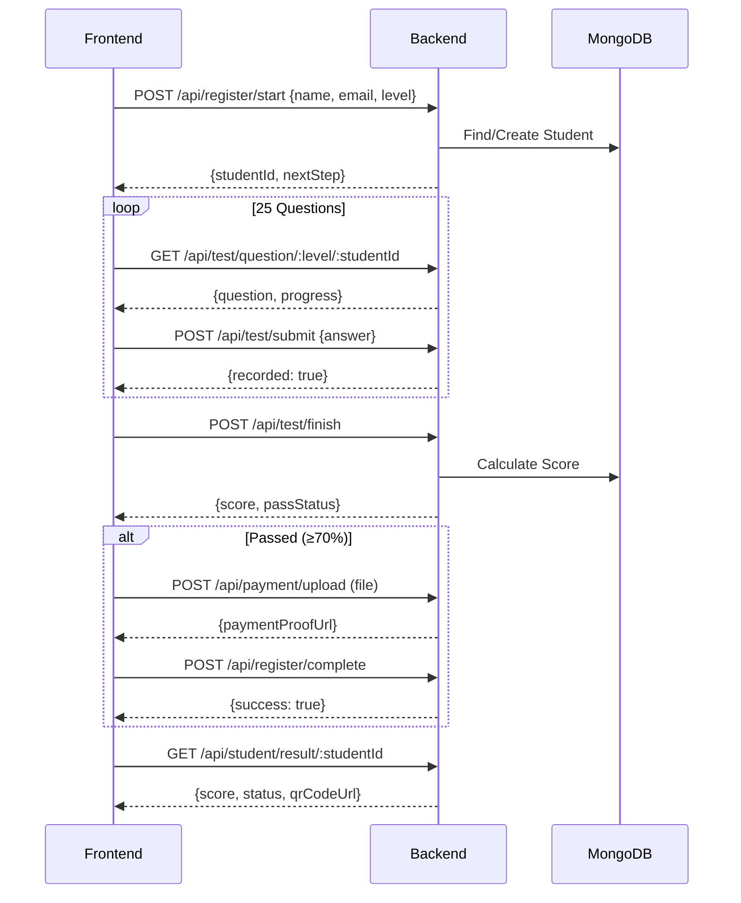

# Nande Nihon Web


**Official Frontend Repository for Nande Nihon Community**

Portal digital utama untuk komunitas **Nande Nihon**, yang memfasilitasi kelas bahasa Jepang intensif, informasi event, webinar, dan konten edukasi seputar budaya Jepang.

---

## 🚨 Package Manager Policy

> [!CAUTION]
> **STRICT POLICY: USE NPM ONLY**
>
> Project ini menggunakan `package-lock.json` untuk menjaga konsistensi dependency di seluruh tim.
> Mohon untuk **TIDAK** menggunakan `yarn`, `pnpm`, atau `bun` untuk menghindari konflik lockfile.

---

## 🛠️ Tech Stack

Dibangun dengan teknologi modern untuk performa dan skalabilitas maksimal:

- **Core**: [Next.js 16](https://nextjs.org/) (App Router)
- **Language**: [TypeScript](https://www.typescriptlang.org/)
- **Styling**: [Tailwind CSS 4](https://tailwindcss.com/)
- **Build System**: [Turborepo 2.7](https://turbo.build/)
- **Database**: [MongoDB](https://www.mongodb.com/) (via Mongoose ODM)
- **Validation**: [Zod](https://zod.dev/)
- **Linter**: [ESLint](https://eslint.org/)

## 📚 Documentation

| Document | Description |
|----------|-------------|
<!-- | [ARCHITECTURE.md](./ARCHITECTURE.md) | Design decisions & rationale |
| [ARCHITECTURE_DIAGRAMS.md](./ARCHITECTURE_DIAGRAMS.md) | Visual Mermaid diagrams |
| [SYSTEM_MAP.md](./SYSTEM_MAP.md) | Technical index & API reference |
| [PRD.md](./PRD.md) | Product requirements | -->

## 📁 Project Structure

Struktur direktori mengikuti standar **Turborepo Monorepo**:

```bash
nandenihon/
├── apps/
│   ├── landing/           # Main app (registration, quiz, payment)
│   ├── student-portal/    # Student dashboard (scaffolded)
│   └── admin-portal/      # Admin panel (testimony & team API)
│       └── app/api/       # REST API endpoints
├── packages/
│   ├── @repo/database     # MongoDB + MySQL connections
│   ├── @repo/types        # Zod schemas + TypeScript types
│   ├── @repo/ui           # Shared form components
│   ├── @repo/utils        # Logger utilities
│   └── @repo/config       # ESLint, TypeScript, PostCSS
├── turbo.json             # Build pipeline configuration
└── package.json           # Workspace configuration
```

## 📏 Naming & Structure Conventions

Agar development tetap konsisten (**satu komando**), ikuti aturan penamaan dan struktur folder berikut:

### 1. File Naming Rules (Aturan Penamaan File)
- **Component**: Gunakan **PascalCase**.
  - ✅ `Navbar.tsx`, `PrimaryButton.tsx`, `UserProfileCard.tsx`
  - ❌ `navbar.tsx`, `primary-button.tsx`, `user_profile_card.tsx`
- **Utility/Hooks/Configs**: Gunakan **camelCase** atau **kebab-case** (sesuaikan dengan standar file).
  - ✅ `useAuth.ts`, `formatDate.ts`, `tailwind-merge.ts`

### 2. Route & Folder Structure
- **App Routes (`app/`)**: Gunakan **kebab-case** (huruf kecil semua dengan pemisah strip).
  - ✅ `app/information-and-rules/`
  - ❌ `app/InformationAndRules/`, `app/information_and_rules/`

### 3. Component Organization
- **Reusable UI Components**: Simpan di `components/ui/`. Ini adalah komponen atomik yang dipakai berulang kali.
  - Contoh: `components/ui/FormInput.tsx`, `components/ui/Button.tsx`.
- **Page-Specific Components**: Buat folder khusus di dalam `components/` sesuai nama halamannya.
  - Jika halaman adalah `/class`, maka komponennya ada di `components/class/`.
  - Contoh: `components/class/InfoCard.tsx`.
  - **JANGAN** membuat komponen UI di dalam folder `app/` (keep `app` clean for routing & layouts).

### 4. Assets Management (Public Folder)
- **General Rule**: Hindari menaruh file di root `public/`. Buat folder spesifik sesuai jenis asetnya.
- **Images**: `public/images/`
  - ✅ `hero-banner.jpg`, `logo-nandenihon.png`
- **Icons**: `public/icons/` (jika berupa file statis seperti .ico/.svg)
- **Fonts**: `public/fonts/`
- **Documents**: `public/docs/`
- **Naming**: Tetap gunakan **kebab-case** untuk semua nama file dan folder di dalam public.

## 🚀 Getting Started

Ikuti langkah-langkah berikut untuk menjalankan project di local machine Anda.

### 1. Clone Repository

```bash
git clone https://github.com/nandenihon/nandenihon.git
cd nandenihon
```

### 2. Install Dependencies

Pastikan Anda menggunakan **npm**:

```bash
npm install
# ❌ Jangan gunakan yarn / pnpm / bun
```

### 3. Run Development Server

```bash
npm run dev
npm run dev:landing # Start landing app
npm run dev:student # Start student portal
npm run dev:admin # Start admin portal
npm run build # Build all apps

```

Buka [http://localhost:3000](http://localhost:3000) di browser Anda untuk melihat hasil landing app.
Buka [http://localhost:3001](http://localhost:3001) di browser Anda untuk melihat hasil student app.
Buka [http://localhost:3002](http://localhost:3002) di browser Anda untuk melihat hasil admin app.

### 4. Environment Variables

> [!IMPORTANT]
> **Setiap app membutuhkan file `.env.local` sendiri.**
>
> Dalam Turborepo monorepo, environment variables di root **TIDAK** otomatis dibagikan ke apps.
> Pastikan setiap app (mis. `apps/landing`) memiliki file `.env.local` dengan konfigurasi yang diperlukan.

```bash
# Salin template ke setiap app
cp .env.example apps/landing/.env.local
cp .env.example apps/student-portal/.env.local
cp .env.example apps/admin-portal/.env.local
```

**Required Variables:**

| Variable | Default | Description |
|----------|---------|-------------|
| `MONGODB_URI` | - | MongoDB connection string (required for landing) |
| `QUIZ_N5_TOTAL_QUESTIONS` | 25 | Total questions for N5 quiz |
| `QUIZ_N5_PASS_THRESHOLD` | 75 | Pass threshold percentage for N5 |
| `QUIZ_N5_TIMER_MINUTES` | 30 | Quiz timer in minutes for N5 |
| `QUIZ_N4_TOTAL_QUESTIONS` | 25 | Total questions for N4 quiz |
| `QUIZ_N4_PASS_THRESHOLD` | 75 | Pass threshold percentage for N4 |
| `QUIZ_N4_TIMER_MINUTES` | 30 | Quiz timer in minutes for N4 |

**Admin Portal Variables (MySQL + SSH Tunnel):**

| Variable | Default | Description |
|----------|---------|-------------|
| `MYSQL_HOST` | 127.0.0.1 | MySQL host (on remote server) |
| `MYSQL_PORT` | 3306 | MySQL port |
| `MYSQL_USER` | - | MySQL username |
| `MYSQL_PASSWORD` | - | MySQL password |
| `MYSQL_DATABASE` | wp_blog_dev | MySQL database name |
| `MYSQL_CONNECTION_MODE` | auto | Set to `ssh-stream` on Vercel/serverless deployments |
| `SSH_HOST` | - | SSH server host for tunnel |
| `SSH_PORT` | 22 | SSH port |
| `SSH_USERNAME` | - | SSH username |
| `SSH_PASSWORD` | - | SSH password (or use SSH_PRIVATE_KEY) |
| `UPLOAD_DIR` | /var/www/nandenihon-ai/uploads | VPS directory for uploaded images |
| `UPLOAD_PUBLIC_PATH` | /uploads | Public URL prefix served by admin portal |
| `NEXT_PUBLIC_UPLOAD_BASE_URL` | https://nandenihon.com | Public base URL for uploaded images |


## 🔧 Backend API Documentation

Backend API sudah selesai diimplementasikan dan siap digunakan oleh tim Frontend.

### Tech Stack Backend
- **Runtime:** Node.js (v18+)
- **Framework:** Next.js 16 (App Router)
- **Database:** MongoDB (via Mongoose ODM)
- **Validation:** Zod

### Data Models

#### Student Schema
```typescript
{
  fullName: string;          // Required
  email: string;             // Required, unique
  level: "N5" | "N4";        // JLPT level
  testStatus: "not_started" | "in_progress" | "completed";
  passStatus: "pending" | "passed" | "failed";
  score: number;             // 0-100
  answerHistory: Array<{
    questionId: ObjectId;
    selectedValue: string | null;
    isCorrect: boolean;
    answeredAt: Date;
  }>;
  nickname?: string;
  whatsapp?: string;
  age?: number;
  domicile?: string;
  motivation?: string;
  paymentProofUrl?: string;
  registrationComplete: boolean;
}
```

#### Question Schema
```typescript
{
  text: string;              // Question text
  options: string[];         // Array of 4 options
  correctAnswer: string;     // Correct option
  timeLimit: number;         // Seconds (default: 30)
  category?: string;         // e.g., "grammar", "vocabulary", "kanji"
  level: "N5" | "N4";        // Required - JLPT level
}
```

### API Endpoints

#### Registration Flow Diagram


---

### API Reference

#### 1. POST /api/student/check-email
Check if email exists and get student status before registration.

**Request:**
```json
{
  "email": "john@example.com",
  "level": "N5"
}
```

**Response (New User):**
```json
{
  "success": true,
  "data": { "exists": false }
}
```

**Response (Passed):**
```json
{
  "success": true,
  "data": {
    "exists": true,
    "status": "passed",
    "studentId": "507f1f77bcf86cd799439011",
    "fullName": "John Doe",
    "level": "N5"
  }
}
```

**Other statuses:** `failed`, `level_mismatch`, `in_progress`

---

#### 2. POST /api/register/start
Lead capture dengan level selection.

**Request:**
```json
{
  "fullName": "John Doe",
  "email": "john@example.com",
  "level": "N5"
}
```

**Response:**
```json
{
  "success": true,
  "data": {
    "studentId": "507f1f77bcf86cd799439011",
    "nextStep": "test_intro"
  }
}
```

---

#### 3. GET /api/test/question/:level/:studentId
Fetch random unanswered question by level.

**Path Parameters:**
- `level`: `N5` atau `N4`
- `studentId`: MongoDB ObjectId

**Response:**
```json
{
  "success": true,
  "data": {
    "question": {
      "id": "507f1f77bcf86cd799439012",
      "text": "「おはよう」の意味は何ですか？",
      "options": ["Good morning", "Good evening", "Good night", "Goodbye"],
      "timeLimit": 30,
      "category": "greeting"
    },
    "progress": {
      "current": 1,
      "total": 25
    },
    "nextStep": "question_display"
  }
}
```

---

#### 4. POST /api/test/submit
Submit answer for a question.

**Request:**
```json
{
  "studentId": "507f1f77bcf86cd799439011",
  "questionId": "507f1f77bcf86cd799439012",
  "selectedValue": "Good morning"
}
```

**Response:**
```json
{
  "success": true,
  "data": {
    "recorded": true,
    "answersCount": 1
  }
}
```

---

#### 5. POST /api/test/finish
Calculate score and determine pass/fail status.

**Request:**
```json
{
  "studentId": "507f1f77bcf86cd799439011"
}
```

**Response:**
```json
{
  "success": true,
  "data": {
    "score": 80,
    "passStatus": "passed",
    "nextStep": "registration_form"
  }
}
```

---

#### 6. POST /api/payment/upload
Upload payment proof (passed students only).

**Content-Type:** `multipart/form-data`

**Form Data:**
- `studentId`: MongoDB ObjectId
- `file`: Image file (jpg, png, pdf - max 5MB)

**Response:**
```json
{
  "success": true,
  "data": {
    "paymentProofUrl": "/uploads/payment/507f1f77bcf86cd799439011_1702834210123.jpg",
    "nextStep": "registration_form"
  }
}
```

---

#### 7. POST /api/register/complete
Complete registration (passed students only).

**Request:**
```json
{
  "studentId": "507f1f77bcf86cd799439011",
  "nickname": "Taro",
  "whatsapp": "081234567890",
  "age": 25,
  "domicile": "Jakarta",
  "motivation": "Work in Japan",
  "level": "N5"
}
```

**Response:**
```json
{
  "success": true,
  "data": {
    "nextStep": "payment_page"
  }
}
```

---

#### 8. GET /api/student/result/:studentId
Get student test result.

**Response:**
```json
{
  "success": true,
  "data": {
    "score": 80,
    "status": "passed",
    "testStatus": "completed",
    "registrationComplete": true
  }
}
```

---

### Testing Backend with curl

#### Prerequisites
1. MongoDB running locally (`npm run seed` to populate questions)
2. Dev server running (`npm run dev`)

#### Happy Path Test Commands (Windows CMD)

```cmd
:: 1. Register new student
curl -X POST http://localhost:3000/api/register/start ^
  -H "Content-Type: application/json" ^
  -d "{\"fullName\":\"Test User\",\"email\":\"test@example.com\",\"level\":\"N5\"}"

:: 2. Get question (replace YOUR_STUDENT_ID)
curl -X GET http://localhost:3000/api/test/question/N5/YOUR_STUDENT_ID

:: 3. Submit answer (replace IDs)
curl -X POST http://localhost:3000/api/test/submit ^
  -H "Content-Type: application/json" ^
  -d "{\"studentId\":\"YOUR_STUDENT_ID\",\"questionId\":\"YOUR_QUESTION_ID\",\"selectedValue\":\"Answer\"}"

:: 4. Finish test (after 25 answers)
curl -X POST http://localhost:3000/api/test/finish ^
  -H "Content-Type: application/json" ^
  -d "{\"studentId\":\"YOUR_STUDENT_ID\"}"

:: 5. Upload payment (passed students only)
curl -X POST http://localhost:3000/api/payment/upload ^
  -F "studentId=YOUR_STUDENT_ID" ^
  -F "file=@payment-proof.jpg"

:: 6. Complete registration
curl -X POST http://localhost:3000/api/register/complete ^
  -H "Content-Type: application/json" ^
  -d "{\"studentId\":\"YOUR_STUDENT_ID\",\"nickname\":\"Taro\",\"whatsapp\":\"08123456789\",\"age\":25,\"domicile\":\"Jakarta\",\"motivation\":\"Study\",\"level\":\"N5\"}"

:: 7. Get result
curl -X GET http://localhost:3000/api/student/result/YOUR_STUDENT_ID
```

#### Automated Testing Scripts
<!-- - **Windows:** `test-backend-api.bat`
- **Mac/Linux:** `test-backend-api.sh`

Both scripts will execute all test cases and export results to `backend-test-results.md`. -->

---

### Database Seeding

Populate database with test questions:

```bash
npm run seed
```

This will insert:
- **25 N5 questions** (culture, greetings, basic vocabulary)
- **25 N4 questions** (grammar, kanji, reading comprehension)

---

## 🔧 Admin Portal API Documentation

Admin Portal API untuk maintenance data **Kata Mereka** (Testimony) dan **Temui Tim Kami** (Team). Menggunakan MySQL database (`wp_blog_dev`) yang diakses melalui SSH tunnel.

### Tech Stack Admin Portal
- **Runtime:** Node.js (v18+)
- **Framework:** Next.js 16 (App Router)
- **Database:** MySQL (via mysql2 + SSH tunnel)

### Data Models

#### Testimony Schema (Kata Mereka)
```typescript
{
  id: number;              // Auto-increment primary key
  photo: string;           // Photo URL (required)
  nickname: string;        // Display name
  email: string;           // Email (required)
  age: number;             // Age
  testimonial_text: string; // Testimonial content
}
```

#### Team Schema (Temui Tim Kami)
```typescript
{
  id: number;              // Auto-increment primary key
  photo: string;           // Photo URL
  full_name: string;       // Full name
  nickname: string;        // Nickname (required)
  place_of_birth: string;  // Birth place
  birth_date: Date;        // Birth date
  email: string;           // Email
  phone_number: number;    // Phone number
  team_group: string;      // Team group
  division: string;        // Division
  jlpt_level: string;      // JLPT level
  domicile: string;        // Domicile
  instagram: string;       // Instagram handle
  motto: string;           // Personal motto
  fun_fact: string;        // Fun fact
  favorites: string;       // Favorites
  join_date: Date;         // Join date (required)
  last_date: Date;         // Last active date
}
```

### Admin API Endpoints

Base URL: `http://localhost:3002`

#### Testimony Endpoints (Kata Mereka)

| Method | Endpoint | Description |
|--------|----------|-------------|
| GET | `/api/testimony` | List all testimonies (paginated) |
| POST | `/api/testimony` | Create new testimony |
| GET | `/api/testimony/:id` | Get single testimony |
| PUT | `/api/testimony/:id` | Update testimony |
| DELETE | `/api/testimony/:id` | Delete testimony |

#### Team Endpoints (Temui Tim Kami)

| Method | Endpoint | Description |
|--------|----------|-------------|
| GET | `/api/team` | List all team members (paginated) |
| POST | `/api/team` | Create new team member |
| GET | `/api/team/:id` | Get single team member |
| PUT | `/api/team/:id` | Update team member |
| DELETE | `/api/team/:id` | Delete team member |

#### Upload Endpoint

| Method | Endpoint | Description |
|--------|----------|-------------|
| POST | `/api/upload` | Upload image file (returns URL) |

#### Class Endpoints (Kelas)

| Method | Endpoint | Description |
|--------|----------|-------------|
| GET | `/api/class` | List all classes (paginated) |
| POST | `/api/class` | Create new class |
| GET | `/api/class/:id` | Get single class |
| PUT | `/api/class/:id` | Update class |
| DELETE | `/api/class/:id` | Delete class |

#### Seminar Endpoints

| Method | Endpoint | Description |
|--------|----------|-------------|
| GET | `/api/seminar` | List all seminars (paginated) |
| POST | `/api/seminar` | Create new seminar |
| GET | `/api/seminar/:id` | Get single seminar |
| PUT | `/api/seminar/:id` | Update seminar |
| DELETE | `/api/seminar/:id` | Delete seminar |

#### Seminar Registration Endpoints

| Method | Endpoint | Description |
|--------|----------|-------------|
| GET | `/api/seminar-registration` | List all registrations (paginated, filterable by `?theme=`) |
| POST | `/api/seminar-registration` | Create new registration |
| GET | `/api/seminar-registration/:id` | Get single registration |
| PUT | `/api/seminar-registration/:id` | Update registration |
| DELETE | `/api/seminar-registration/:id` | Delete registration |

### Admin API Reference

#### 1. GET /api/testimony
List all testimonies with pagination.

**Query Parameters:**
- `page` (optional): Page number (default: 1)
- `limit` (optional): Items per page (default: 10)

**Response:**
```json
{
  "data": [
    {
      "id": 1,
      "photo": "/uploads/photo.jpg",
      "nickname": "John",
      "email": "john@example.com",
      "age": 25,
      "testimonial_text": "Great experience!"
    }
  ],
  "pagination": {
    "page": 1,
    "limit": 10,
    "total": 1,
    "totalPages": 1
  }
}
```

---

#### 2. POST /api/testimony
Create new testimony.

**Request:**
```json
{
  "photo": "/uploads/photo.jpg",
  "nickname": "John",
  "email": "john@example.com",
  "age": 25,
  "testimonial_text": "Great experience!"
}
```

**Response (201):**
```json
{
  "data": {
    "id": 1,
    "photo": "/uploads/photo.jpg",
    "nickname": "John",
    "email": "john@example.com",
    "age": 25,
    "testimonial_text": "Great experience!"
  }
}
```

---

#### 3. POST /api/upload
Upload image file.

**Content-Type:** `multipart/form-data`

**Form Data:**
- `file`: Image file (jpg, png, webp, gif - max 5MB)

**Response:**
```json
{
  "url": "/uploads/1707380000000-abc123.jpg",
  "filename": "1707380000000-abc123.jpg",
  "size": 102400,
  "type": "image/jpeg"
}
```

---

#### 4. GET /api/class
List all classes with pagination.

**Query Parameters:**
- `page` (optional): Page number (default: 1)
- `limit` (optional): Items per page (default: 10)

**Response:**
```json
{
  "data": [
    {
      "id": 1,
      "class_name": "Japanese Intensive N5",
      "level": "N5",
      "description": "Kelas intensif bahasa Jepang level N5 untuk pemula.",
      "register_start": "2025-06-01T00:00:00.000Z",
      "register_end": "2025-06-30T00:00:00.000Z",
      "register_fee": "350000.00",
      "status": "open",
      "image_banner": "/uploads/banner-n5.jpg"
    }
  ],
  "pagination": {
    "page": 1,
    "limit": 10,
    "total": 1,
    "totalPages": 1
  }
}
```

---

#### 5. POST /api/class
Create a new class.

**Request:**
```json
{
  "class_name": "Japanese Intensive N5",
  "level": "N5",
  "description": "Kelas intensif bahasa Jepang level N5 untuk pemula.",
  "register_start": "2025-06-01 00:00:00",
  "register_end": "2025-06-30 23:59:59",
  "register_fee": 350000,
  "status": "open",
  "image_banner": "/uploads/banner-n5.jpg"
}
```

**Response (201):**
```json
{
  "data": {
    "id": 1,
    "class_name": "Japanese Intensive N5",
    "level": "N5",
    "description": "Kelas intensif bahasa Jepang level N5 untuk pemula.",
    "register_start": "2025-06-01T00:00:00.000Z",
    "register_end": "2025-06-30T23:59:59.000Z",
    "register_fee": "350000.00",
    "status": "open",
    "image_banner": "/uploads/banner-n5.jpg"
  }
}
```

**Error (400) — Missing required field:**
```json
{
  "error": "Missing required fields",
  "details": "class_name, level, description, register_start, register_end, register_fee, status, and image_banner are required"
}
```

---

#### 6. GET /api/class/:id
Get single class by ID.

**Response:**
```json
{
  "data": {
    "id": 1,
    "class_name": "Japanese Intensive N5",
    "level": "N5",
    "description": "Kelas intensif bahasa Jepang level N5 untuk pemula.",
    "register_start": "2025-06-01T00:00:00.000Z",
    "register_end": "2025-06-30T23:59:59.000Z",
    "register_fee": "350000.00",
    "status": "open",
    "image_banner": "/uploads/banner-n5.jpg"
  }
}
```

**Error (404):**
```json
{ "error": "Class not found" }
```

---

#### 7. PUT /api/class/:id
Update class by ID. Only send the fields you want to change.

**Request:**
```json
{
  "status": "closed",
  "register_fee": 400000
}
```

**Response:**
```json
{
  "data": {
    "id": 1,
    "class_name": "Japanese Intensive N5",
    "level": "N5",
    "description": "Kelas intensif bahasa Jepang level N5 untuk pemula.",
    "register_start": "2025-06-01T00:00:00.000Z",
    "register_end": "2025-06-30T23:59:59.000Z",
    "register_fee": "400000.00",
    "status": "closed",
    "image_banner": "/uploads/banner-n5.jpg"
  }
}
```

---

#### 8. DELETE /api/class/:id
Delete class by ID.

**Response:**
```json
{ "message": "Class deleted successfully" }
```

---

#### 9. GET /api/seminar
List all seminars with pagination.

**Query Parameters:**
- `page` (optional): Page number (default: 1)
- `limit` (optional): Items per page (default: 10)

**Response:**
```json
{
  "data": [
    {
      "id": 1,
      "theme": "Karir di Jepang: Peluang dan Tantangan",
      "speaker": "Budi Santoso",
      "event_date": "2025-07-15",
      "event_time": "14:00:00",
      "image_banner": "/uploads/seminar-banner.jpg",
      "status": "upcoming"
    }
  ],
  "pagination": {
    "page": 1,
    "limit": 10,
    "total": 1,
    "totalPages": 1
  }
}
```

---

#### 10. POST /api/seminar
Create a new seminar.

**Request:**
```json
{
  "theme": "Karir di Jepang: Peluang dan Tantangan",
  "speaker": "Budi Santoso",
  "event_date": "2025-07-15",
  "event_time": "14:00",
  "image_banner": "/uploads/seminar-banner.jpg",
  "status": "upcoming"
}
```

**Response (201):**
```json
{
  "data": {
    "id": 1,
    "theme": "Karir di Jepang: Peluang dan Tantangan",
    "speaker": "Budi Santoso",
    "event_date": "2025-07-15",
    "event_time": "14:00:00",
    "image_banner": "/uploads/seminar-banner.jpg",
    "status": "upcoming"
  }
}
```

**Error (400) — Missing required field:**
```json
{
  "error": "Missing required fields",
  "details": "theme, speaker, event_date, event_time, image_banner, and status are required"
}
```

---

#### 11. GET /api/seminar/:id
Get single seminar by ID.

**Response:**
```json
{
  "data": {
    "id": 1,
    "theme": "Karir di Jepang: Peluang dan Tantangan",
    "speaker": "Budi Santoso",
    "event_date": "2025-07-15",
    "event_time": "14:00:00",
    "image_banner": "/uploads/seminar-banner.jpg",
    "status": "upcoming"
  }
}
```

**Error (404):**
```json
{ "error": "Seminar not found" }
```

---

#### 12. PUT /api/seminar/:id
Update seminar by ID. Only send the fields you want to change.

**Request:**
```json
{
  "status": "done",
  "event_time": "15:30"
}
```

**Response:**
```json
{
  "data": {
    "id": 1,
    "theme": "Karir di Jepang: Peluang dan Tantangan",
    "speaker": "Budi Santoso",
    "event_date": "2025-07-15",
    "event_time": "15:30:00",
    "image_banner": "/uploads/seminar-banner.jpg",
    "status": "done"
  }
}
```

---

#### 13. DELETE /api/seminar/:id
Delete seminar by ID.

**Response:**
```json
{ "message": "Seminar deleted successfully" }
```

---

#### 14. GET /api/seminar-registration
List all seminar registrations with pagination.
Supports optional `?theme=` query param to filter by seminar theme.

**Query Parameters:**
- `page` (optional): Page number (default: 1)
- `limit` (optional): Items per page (default: 10)
- `theme` (optional): Filter registrations by seminar theme (exact match)

**Response:**
```json
{
  "data": [
    {
      "id": 1,
      "full_name": "Rina Putri",
      "gender": "female",
      "age": 22,
      "domicile": "Jakarta",
      "whatsapp_number": 6281234567890,
      "source": "Instagram",
      "question": "Apakah ada sertifikat?",
      "theme": "Karir di Jepang: Peluang dan Tantangan"
    }
  ],
  "pagination": {
    "page": 1,
    "limit": 10,
    "total": 1,
    "totalPages": 1
  }
}
```

---

#### 15. POST /api/seminar-registration
Create a new seminar registration.

**Request:**
```json
{
  "full_name": "Rina Putri",
  "gender": "female",
  "age": 22,
  "domicile": "Jakarta",
  "whatsapp_number": 6281234567890,
  "source": "Instagram",
  "question": "Apakah ada sertifikat?",
  "theme": "Karir di Jepang: Peluang dan Tantangan"
}
```

> `question` is optional — omit or set to `null` if the registrant has no question.

**Response (201):**
```json
{
  "data": {
    "id": 1,
    "full_name": "Rina Putri",
    "gender": "female",
    "age": 22,
    "domicile": "Jakarta",
    "whatsapp_number": 6281234567890,
    "source": "Instagram",
    "question": "Apakah ada sertifikat?",
    "theme": "Karir di Jepang: Peluang dan Tantangan"
  }
}
```

**Error (400) — Missing required field:**
```json
{
  "error": "Missing required fields",
  "details": "full_name, gender, age, domicile, whatsapp_number, source, and theme are required"
}
```

---

#### 16. GET /api/seminar-registration/:id
Get single seminar registration by ID.

**Response:**
```json
{
  "data": {
    "id": 1,
    "full_name": "Rina Putri",
    "gender": "female",
    "age": 22,
    "domicile": "Jakarta",
    "whatsapp_number": 6281234567890,
    "source": "Instagram",
    "question": "Apakah ada sertifikat?",
    "theme": "Karir di Jepang: Peluang dan Tantangan"
  }
}
```

**Error (404):**
```json
{ "error": "Seminar registration not found" }
```

---

#### 17. PUT /api/seminar-registration/:id
Update seminar registration by ID. Only send the fields you want to change.

**Request:**
```json
{
  "domicile": "Bandung",
  "question": null
}
```

**Response:**
```json
{
  "data": {
    "id": 1,
    "full_name": "Rina Putri",
    "gender": "female",
    "age": 22,
    "domicile": "Bandung",
    "whatsapp_number": 6281234567890,
    "source": "Instagram",
    "question": null,
    "theme": "Karir di Jepang: Peluang dan Tantangan"
  }
}
```

---

#### 18. DELETE /api/seminar-registration/:id
Delete seminar registration by ID.

**Response:**
```json
{ "message": "Seminar registration deleted successfully" }
```

---

### Testing Admin API with curl

#### Prerequisites
1. SSH tunnel configured in `.env.local`
2. Admin portal running (`npm run dev:admin`)

#### Test Commands (Bash/Git Bash)

> [!NOTE]
> Database has NOT NULL constraints on certain columns. Required fields are:
> - **Testimony**: `photo`, `email`
> - **Team**: `birth_date`, `phone_number`, `join_date`, `last_date`
> - **Class**: all fields are required
> - **Seminar**: all fields are required
> - **Seminar Registration**: all fields except `question` are required

```bash
# ================================
# TESTIMONY ENDPOINTS
# ================================

# 1. List all testimonies (with pagination)
curl http://localhost:3002/api/testimony
curl "http://localhost:3002/api/testimony?page=1&limit=5"

# 2. Create new testimony (photo and email are required)
curl -X POST http://localhost:3002/api/testimony \
  -H "Content-Type: application/json" \
  -d '{"photo":"/uploads/photo.jpg","nickname":"Test User","email":"test@example.com","age":25,"testimonial_text":"Great experience!"}'

# 3. Get single testimony by ID
curl http://localhost:3002/api/testimony/1

# 4. Update testimony
curl -X PUT http://localhost:3002/api/testimony/1 \
  -H "Content-Type: application/json" \
  -d '{"nickname":"Updated Name","age":26}'

# 5. Delete testimony
curl -X DELETE http://localhost:3002/api/testimony/1

# ================================
# TEAM ENDPOINTS
# ================================

# 6. List all team members (with pagination)
curl http://localhost:3002/api/team
curl "http://localhost:3002/api/team?page=1&limit=5"

# 7. Create new team member (birth_date, phone_number, join_date, last_date are required)
curl -X POST http://localhost:3002/api/team \
  -H "Content-Type: application/json" \
  -d '{"photo":"/uploads/team.jpg","full_name":"John Doe","nickname":"Johnny","birth_date":"1995-05-15","email":"john@example.com","phone_number":812345678,"team_group":"Core","division":"Engineering","jlpt_level":"N2","join_date":"2025-01-01","last_date":"2025-12-31"}'

# 8. Get single team member by ID
curl http://localhost:3002/api/team/1

# 9. Update team member
curl -X PUT http://localhost:3002/api/team/1 \
  -H "Content-Type: application/json" \
  -d '{"nickname":"Updated Johnny","division":"Marketing"}'

# 10. Delete team member
curl -X DELETE http://localhost:3002/api/team/1

# ================================
# UPLOAD ENDPOINT
# ================================

# 11. Upload image (multipart/form-data)
curl -X POST http://localhost:3002/api/upload \
  -F "file=@/path/to/image.jpg"

# ================================
# CLASS ENDPOINTS
# ================================

# 12. List all classes (with pagination)
curl http://localhost:3002/api/class
curl "http://localhost:3002/api/class?page=1&limit=5"

# 13. Create new class (all fields are required)
curl -X POST http://localhost:3002/api/class \
  -H "Content-Type: application/json" \
  -d '{"class_name":"Japanese Intensive N5","level":"N5","description":"Kelas intensif bahasa Jepang level N5 untuk pemula.","register_start":"2025-06-01 00:00:00","register_end":"2025-06-30 23:59:59","register_fee":350000,"status":"open","image_banner":"/uploads/banner-n5.jpg"}'

# 14. Get single class by ID
curl http://localhost:3002/api/class/1

# 15. Update class (partial update — only changed fields)
curl -X PUT http://localhost:3002/api/class/1 \
  -H "Content-Type: application/json" \
  -d '{"status":"closed","register_fee":400000}'

# 16. Delete class
curl -X DELETE http://localhost:3002/api/class/1

# ================================
# SEMINAR ENDPOINTS
# ================================

# 17. List all seminars (with pagination)
curl http://localhost:3002/api/seminar
curl "http://localhost:3002/api/seminar?page=1&limit=5"

# 18. Create new seminar (all fields are required)
curl -X POST http://localhost:3002/api/seminar \
  -H "Content-Type: application/json" \
  -d '{"theme":"Karir di Jepang: Peluang dan Tantangan","speaker":"Budi Santoso","event_date":"2025-07-15","event_time":"14:00","image_banner":"/uploads/seminar-banner.jpg","status":"upcoming"}'

# 19. Get single seminar by ID
curl http://localhost:3002/api/seminar/1

# 20. Update seminar (partial update — only changed fields)
curl -X PUT http://localhost:3002/api/seminar/1 \
  -H "Content-Type: application/json" \
  -d '{"status":"done","event_time":"15:30"}'

# 21. Delete seminar
curl -X DELETE http://localhost:3002/api/seminar/1

# ================================
# SEMINAR REGISTRATION ENDPOINTS
# ================================

# 22. List all registrations (with pagination)
curl http://localhost:3002/api/seminar-registration
curl "http://localhost:3002/api/seminar-registration?page=1&limit=5"

# 23. Filter registrations by seminar theme
curl "http://localhost:3002/api/seminar-registration?theme=Karir+di+Jepang%3A+Peluang+dan+Tantangan"

# 24. Create new registration (question is optional, all others required)
curl -X POST http://localhost:3002/api/seminar-registration \
  -H "Content-Type: application/json" \
  -d '{"full_name":"Rina Putri","gender":"female","age":22,"domicile":"Jakarta","whatsapp_number":6281234567890,"source":"Instagram","question":"Apakah ada sertifikat?","theme":"Karir di Jepang: Peluang dan Tantangan"}'

# 25. Create registration without optional question field
curl -X POST http://localhost:3002/api/seminar-registration \
  -H "Content-Type: application/json" \
  -d '{"full_name":"Andi Saputra","gender":"male","age":25,"domicile":"Surabaya","whatsapp_number":6289876543210,"source":"Teman","theme":"Karir di Jepang: Peluang dan Tantangan"}'

# 26. Get single registration by ID
curl http://localhost:3002/api/seminar-registration/1

# 27. Update registration (partial update — only changed fields)
curl -X PUT http://localhost:3002/api/seminar-registration/1 \
  -H "Content-Type: application/json" \
  -d '{"domicile":"Bandung"}'

# 28. Delete registration
curl -X DELETE http://localhost:3002/api/seminar-registration/1
```

## 🤝 Contribution

Kontribusi sangat diterima! Silakan buat **Pull Request** atau laporkan **Issue** jika menemukan bug atau memiliki ide fitur baru.

---

<p align="center">
  © Nande Nihon Community. All rights reserved.
</p>
